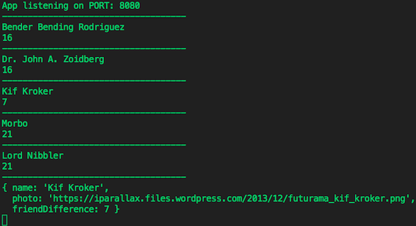

<h1 align="center">FriendFinder: Futurama Edition</h1>

Compatibility-based matching to find a new friend from the world of Futurama.

## Deployed Application

[Heroku] <https://morning-shelf-62146.herokuapp.com/>

## Concept

Fill out a survey form and be matched with a friend from a list of Futurama characters.

## Technologies Used

Express, API Routing, JavaScript, jQuery, Materialize CSS

<!-- ## Key Features

* thing 1 -->

### Application Process

1. Click the survey button to begin a 10-question survey
1. Begin selecting one answer in each drop-down menu
1. Answers get compared to scores of existing potential friends
1. A modal will render with the name and image of a friend with the lowest number "friendDifference"

### Screenshots

###### Application in action

###### Match results

*Happy friending!*