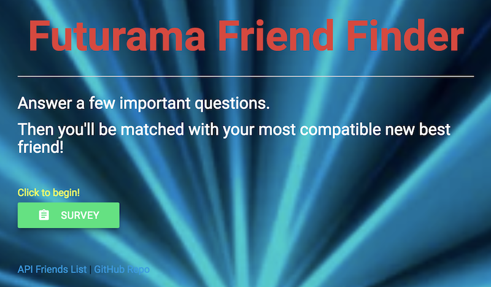
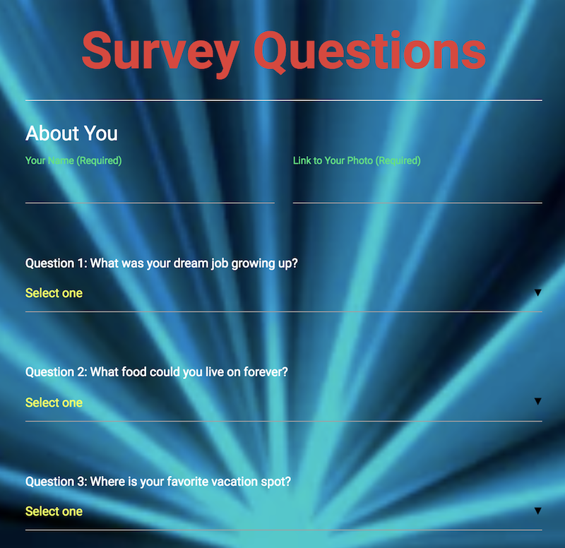

<h1 align="center">FriendFinder: Futurama Edition</h1>

Compatibility-based matching to find a new friend from the world of Futurama.

## Deployed Application

[Heroku] <https://morning-shelf-62146.herokuapp.com/>

## Concept

Answer a few simple questions and be paired with a friend, based on compatibility

## Technologies Used

Express, API Routing, JavaScript, jQuery, Materialize CSS

<!-- ## Key Features

* thing 1 -->

### Screenshots

###### Main Screen

###### Survey Screen

### Application Process

1. Click the survey button to begin a 10-question survey
1. Begin selecting one answer in each drop-down menu
1. Answers get compared to scores of existing potential friends (the closest match of answers)
1. A modal will render with the user's new friend name and image

*Happy friending!*